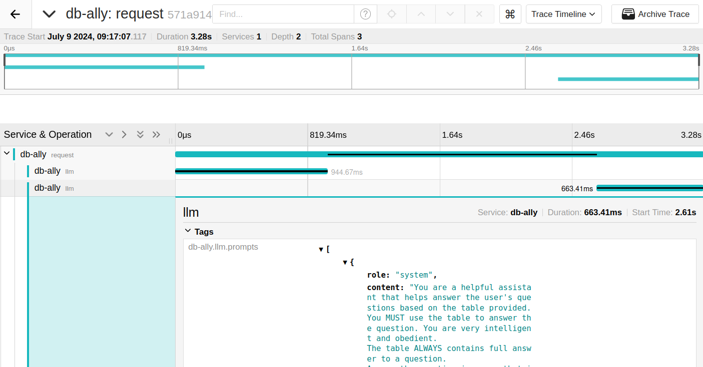

# How-To: Trace runs with OpenTelemetry

db-ally provides you a way to track execution of the query processing using
[OpenTelemetry](https://opentelemetry.io/) standard. As db-ally is a library, it only depends on the
[OpenTelemtry API](https://opentelemetry.io/docs/specs/otel/overview/#api). For projects that use db-ally, include
[OpenTelemetry SDK](https://opentelemetry.io/docs/specs/otel/overview/#sdk) or perform
[Auto Instrumentation](https://opentelemetry.io/docs/zero-code/python/).


## Step-by-step guide

1. [Python OpenTelemetry SDK](https://opentelemetry-python.readthedocs.io/en/latest/sdk/index.html) must be installed:

    ```bash
    pip install opentelemetry-sdk
    ```

2. To capture the traces, you can use [Jeager](https://www.jaegertracing.io/). An open-source software for telemetry
    data. The recommended option is to start with Docker. You can run:

    ```bash
    docker run --network host --rm --name jeager -e COLLECTOR_ZIPKIN_HTTP_PORT=9411 jaegertracing/all-in-one
    ```

    For simplicity we are using `--network host`, however, do not use this settings in production deployments and
    expose only ports that are needed.

3. Import required OpenTelemetry SDKs and db-ally OTel Handler:

    ```python
    from dbally.audit.event_handlers.otel_event_handler import OtelEventHandler

    from opentelemetry.sdk.trace import TracerProvider
    from opentelemetry.sdk.resources import Resource
    from opentelemetry.exporter.otlp.proto.grpc.trace_exporter import OTLPSpanExporter
    from opentelemetry.sdk.trace.export import BatchSpanProcessor
    ```

4. Setup the OTel exporter in your project:

    ```python
    exporeter = OTLPSpanExporter("http://localhost:4317", insecure=True)
    provider = TracerProvider(resource=Resource({"service.name": "db-ally"}))
    processor = BatchSpanProcessor(exporeter)
    provider.add_span_processor(processor)
    handler = OtelEventHandler(provider)
    ```

    Using Resource you can add a name for your service. OTLPSpanExporter is used to export telemetry data using gRPC or
    HTTP to desired location. We mark it as insecure, as demo does not use TLS. To efficently send data over network,
    we should use BatchSpanProcessor to batch exports of telemetry data. Finally, we setup the db-ally handler.

5. Use handler with collection:

    ```python
    df = pd.DataFrame({
        "name": ["Alice", "Bob", "Charlie", "David", "Eve"],
        "city": ["New York", "Los Angeles", "Chicago", "Houston", "Phoenix"],
    })

    llm = LiteLLM(model_name="gpt-4o")
    collection = dbally.create_collection("clients", llm=llm, event_handlers=[handler], nl_responder=NLResponder(llm))
    collection.add(ClientView, lambda: ClientView(df))
    ```

6. Ask your questions:

    ```python
    result = await collection.ask("What clients are from Huston?", return_natural_response=True)
    print(result)
    ```

7. Explore your traces in observability platform (Jeager in our case):

    


## Full code example

```python
import asyncio
import pandas as pd

import dbally
from dbally import DataFrameBaseView
from dbally.audit.event_handlers.otel_event_handler import OtelEventHandler
from dbally.nl_responder.nl_responder import NLResponder
from dbally.views import decorators
from dbally.llms import LiteLLM

from opentelemetry.sdk.trace import TracerProvider
from opentelemetry.sdk.resources import Resource
from opentelemetry.exporter.otlp.proto.grpc.trace_exporter import OTLPSpanExporter
from opentelemetry.sdk.trace.export import BatchSpanProcessor


class ClientView(DataFrameBaseView):

    @decorators.view_filter()
    def filter_by_city(self, city: str):
        return self.df['city'] == city


async def main():
    exporeter = OTLPSpanExporter("http://localhost:4317", insecure=True)
    provider = TracerProvider(resource=Resource({"service.name": "db-ally"}))
    processor = BatchSpanProcessor(exporeter)
    provider.add_span_processor(processor)
    handler = OtelEventHandler(provider)

    df = pd.DataFrame({
        "name": ["Alice", "Bob", "Charlie", "David", "Eve"],
        "city": ["New York", "Los Angeles", "Chicago", "Houston", "Phoenix"],
    })

    llm = LiteLLM(model_name="gpt-4o")
    collection = dbally.create_collection("clients", llm=llm, event_handlers=[handler], nl_responder=NLResponder(llm))
    collection.add(ClientView, lambda: ClientView(df))

    result = await collection.ask("What clients are from Huston?", return_natural_response=True)
    print(result)


if __name__ == '__main__':
    asyncio.run(main())
```