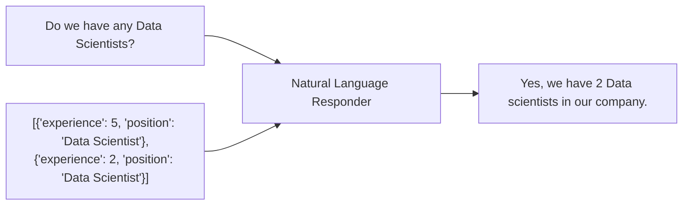

# Natural Language Responder

`NLResponder` class can be utilized to transform a database output into a natural language response to user queries.

The method used to generate the response is `self.generate_response`. It essentially generates a natural language response to the user's question using a LLM. Here's a breakdown of the steps:

1. The results of the query execution are converted to a Markdown table.
2. The number of tokens in `nl_responder_prompt_template` supplemented with the table from point 1 is counted.
3. If the token count exceeds a predefined maximum (`self.max_tokens_count`), a response is generated using a `iql_explainer_prompt_template`.
It will return a description of the results based on the query, omitting table analysis step.
Otherwise, a response is generated using a `nl_responder_prompt_template`.

!!! tip
    To understand general idea better, visit the [NL Responder concept page](../concepts/nl_responder.md).

::: dbally.nl_responder.nl_responder.NLResponder
