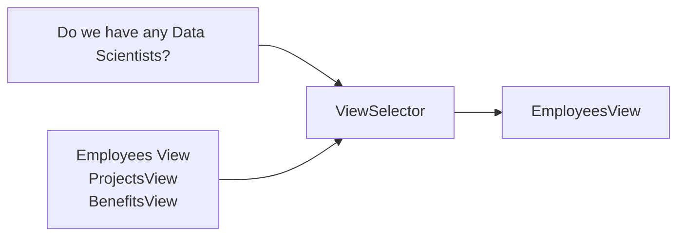

# ViewSelector Base Class

View selectors are responsible for choosing the most relevant View for the given user query.

```mermaid
flowchart LR
    Q[Do we have any Data Scientists?]
    Views["`Employees View
    ProjectsView
    BenefitsView`"]
    VS[ViewSelector]

    Q --> VS
    Views --> VS
    VS --> S[EmployeesView]
```

::: dbally.view_selection.base.ViewSelector
